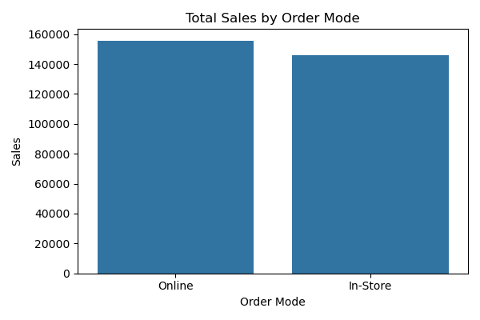
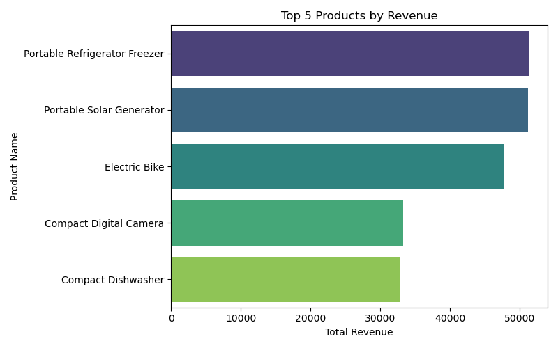

# RDAMP Sales Analysis – Ace Superstore

## Overview
This project provides a business intelligence summary of Ace Superstore's sales performance across regions and segments.

## Tools Used
- Python
- Pandas
- Seaborn / Matplotlib
- Jupyter/VS Code

## Key Insights
- **Top Products**: Portable Refrigerator Freezer, Solar Generator, and Electric Bike are the highest revenue generators.
- **Regional Trends**: Online and In-Store sales vary slightly by region, but both are strong in Yorkshire and the Humber.
- **Highest Margins**: Categories like Outdoor, Kitchen, and Home deliver the greatest profits.
- **Discount Rates**: Discounts are relatively stable across regions, averaging ~17%.

## Visualizations

### 1. Total Sales by Order Mode  

### 2. Top 5 Products by Revenue  

### 3. Top 10 Categories by Margin  

## Files Included
- `main.py`: Analysis script
- `Ace Superstore Retail Dataset.xlsx`: Cleaned dataset
- Charts: `sales_by_order_mode.png`, `top_5_products.png`, `top_margin_categories.png`

## Author
Ilias Prevyzis – RDAMP Task 1 Submission
